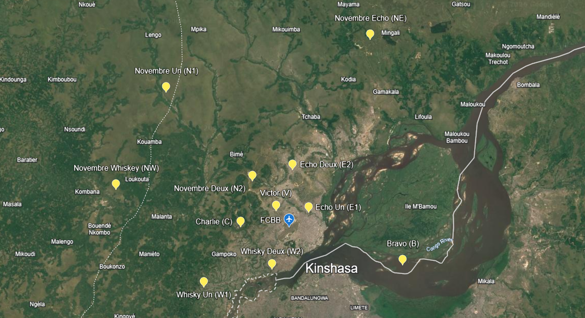
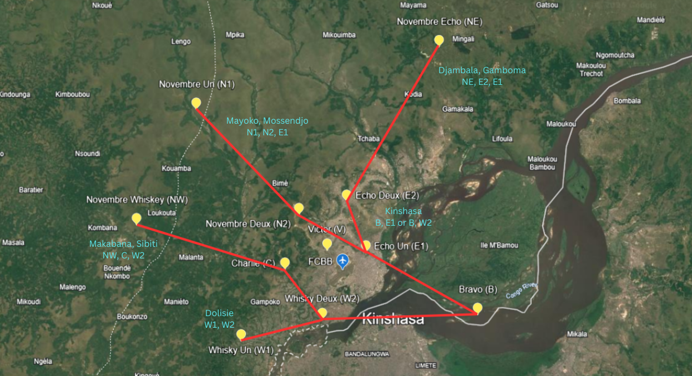

# Tower

The responsibility of Tower at Brazzaville falls to the dedicated Tower ATS unit, Brazzaville Tower (FCBB_TWR) on 118.700. TWR will be responsible for the movements on the runway, as well as the responsibility of ensuring safety amongst VFR aircraft operating in the circuit or within the Brazzaville CTR from GND - 3000ft MSL.

## Visual Flight Rules (VFR) Aircraft

| Type | Circuit Altitude |
| :---------: | :---------: |
| Jet | 3000ft |
| Turbine / Piston | 3000ft |
| Helicopter | 3000ft |

 - All circuits are conducted left hand normally, but may be conducted right hand at the discretion of the Tower controller.   

!!! info "Circuit Clearance"
    ZSABC, hold position, after departure Runway XX, Left hand circuits, not above altitude 3000ft, report L / R downwind Runway XX.

!!! info "Circuit Clearance (Non STD)"
    ZSABC, hold position, after departure Runway XX, non standard Right hand circuits, not above altitude 3000ft, report non standard L / R downwind Runway XX.

### VRP Map

Base imagery © Google and imagery providers. Used in accordance with Google Maps/Earth permissions.

### VFR Departures

There are no standard VFR routings for departures out of FCBB. 

!!! info "Exit Clearance"
    ZSABC, hold position, after departure Runway XX, cleared to exit the Brazzaville CTR to the N / S / E / W, not above altitude 3000ft report leaving the CTR / report "VRP".

### VFR Arrivals

Base imagery © Google and imagery providers. Used in accordance with Google Maps/Earth permissions.

!!! info
    All standard VFR routes will require pilots to be given further instructions to join the circuit. None of the standard routings favour a certain runway.

## Wake Seperation

### Arrivals (nm)
| Lead  | J | H | M | L |
| :---------: | :---------: | :---------: | :---------: | :---------: | 
| J     | ||||
| H     | 6 | 4 | ||
| M     | 7 | 5 | 5 | |
| L     | 8 | 6 | 5 | 5 |

### Departures (mins)

| Lead  | J | H | M | L |
| :---------: | :---------: | :---------: | :---------: | :---------: | 
| J     | ||||
| H     | 2 | |||
| M     | 3 | 2 | ||
| L     | 3 | 2 | 2 | |

## Takeoff Phraseology

!!! info "Takeoff (Full Length)"
    ZSABC, Runway XX, wind 080 degrees at 9 knots, cleared for takeoff, report airborne.

!!! info "Takeoff (Intersection)"
    ZSABC, Runway XX at XX, wind 080 degrees at 9 knots, cleared for takeoff, report airborne.

!!! info "Handoff"
    ZSABC, Contact Brazzaville Approach 121.100.
