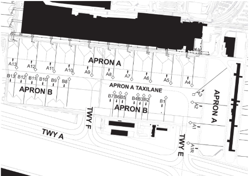
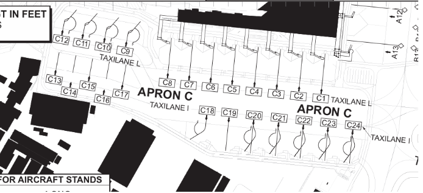
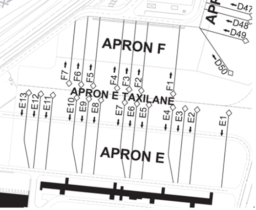
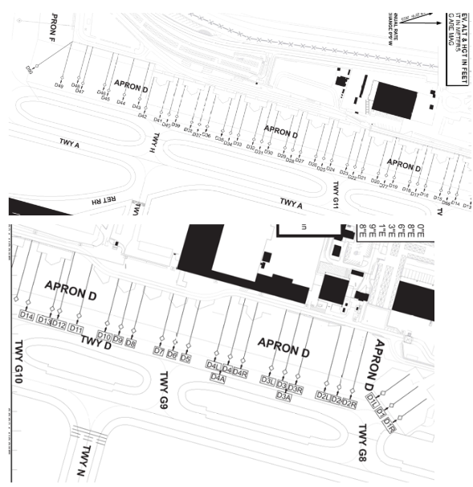
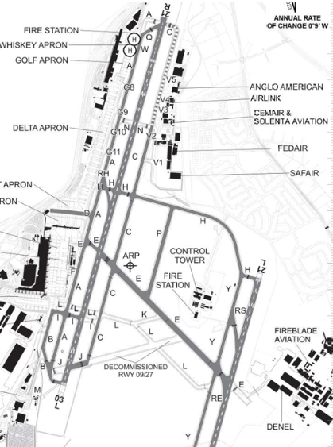
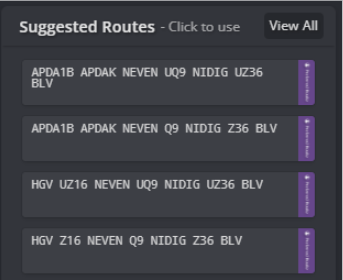
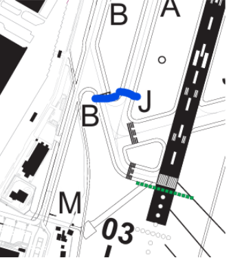

# O.R. Tambo (FAOR)

## General
O. R. Tambo International Airport is an international airport serving the twin cities of Johannesburg and the main capital of South Africa, Pretoria. It is situated in Kempton Park, Gauteng. It serves as the primary airport for domestic and international travel for South Africa and since 2020, it is Africa's second busiest airport, with a capacity to handle up to 28 million passengers annually. The airport serves as the hub for South African Airways. The airport handled over 21 million passengers in 2017. 

### Charts

Charts for Johannesburg O.R. Tambo (FAOR), and across South Africa can be publicly accessed by ChartFox, or directly through the South African CAA website, which will also include VFR charts for use around Johannesburg. All links can be found below:

- ChartFox: [FAOR charts | ChartFox](https://chartfox.org/FAOR)

- South African [CAA: Aeronautical-Charts – SACAA](https://www.caa.co.za/aeronautical-charts/)

- South African [VFR Charts: Aeronautical Information VFR Charts – SACAA](https://www.caa.co.za/industry-information/aeronautical-information-vfr-charts/)

Alternatively, users of MSFS2024 are more than welcome to use the inbuilt flight planner for charts: [Flight Planner](https://planner.flightsimulator.com/)

### Sceneries

(C) - We can not guarantee that this scenery is compatible with MSFS 2024.

| Simulator | Developer | Type | Link |
| :---------: | :---------: | :---------: | :---------: |
| FS20/24 | iniBuilds | Payware | [iniBuilds Johannesburg O.R. Tambo (FAOR) for MSFS – iniBuilds Store](https://inibuilds.com/products/inibuilds-johannesburg-faor-msfs?_pos=1&_sid=3b6ba4d52&_ss=r)
| FS20 (C) | Gaffer Simulations | Payware | [Gaffer Simulations Johannesburg (FAOR) for MSFS-2020 – iniBuilds Store](https://inibuilds.com/products/gaffer-simulations-johannesburg-faor-msfs?_pos=2&_sid=3b6ba4d52&_ss=r) |
| FS20 (C) | NSAJID | Freeware | [FAOR - O. R. Tambo International Airport for Microsoft Flight Simulator - MSFS](https://flightsim.to/file/65986/faor-o-r-tambo-international-airport)
| XP11/XP12 | tdg | Freeware | [FAOR - O.R. Tambo International Airport Johannesburg - Scenery Packages - X-Plane.Org Forum](https://forums.x-plane.org/index.php?/files/file/51250-faor-or-tambo-international-airport-johannesburg/)
| P3D | Gaffer Simulations | Payware | [simMarket: OR TAMBO INTERNATIONAL AIRPORT P3D4 - JOHANNESBURG](https://secure.simmarket.com/gaffer-simulations-or-tambo-international-airport-p3d4-johannesburg.phtml)

### ATS Frequencies

| Position    | Callsign              | Frequency | Remarks             |
| :---------: | :---------: | :---------: | :---------: |
| FAOR_ATIS   | Johannesburg ATIS     | 126.200   | -                   |
| FAOR_DEL    | O.R. Tambo Clearance Delivery    | 121.700   | -        |
| FAOR_GND    | O.R. Tambo Ground       | 121.900   | Responsible of Aerodrome West of 03L/21R |
| FAOR_TWR    | O.R. Tambo Tower    | 118.100   | -                     |
| FAOR_E_TWR  | O.R. Tambo Tower    | 118.600   | Responsible of Aerodrome between the two runways |
| FAOR_APP    | Johannesburg Radar  | 124.500   | -                     |
| FAOR_W_APP    | Johannesburg Radar  | 123.700   | -                   |
| FAOR_F_APP  | Johannesburg Director | 121.400   | -                   |
| FAJA_CTR    | Johannesburg Area     | 134.400   | Frequency can be used for FAJA_N or FAJA_NE |
| FAJA_NW_CTR    | Johannesburg Area     | 126.700   | -                |
| FAJA_SW_CTR    | Johannesburg Area     | 128.300   | -                |
| FAJA_SE_CTR    | Johannesburg Area     | 132.150   | -                |

## Aerodrome

### Stands
O.R. Tambo has many different parking stands, each for their own use, either for domestic or international flights, or based on aircraft type (i.e. Airbus A380, Boeing 737, etc). Below, you can find a list of all available stands for use, and whether you should be spawning at it, based on your aircraft type.

#### Aprons A and B

Aprons A and B are used for a mix of both international and domestic traffic:

- Stands A1R, A1-A7: International

- Stands A8-A13: Domestic

- Stands B1-B13: Domestic only

All Apron A stands are suitable for Code E aircraft. (excluding A13 and A12).
B1, B3 and B6 can be used for Code E. The remainder of the Apron B stands can only be used by Code C aircraft.

If B3 is occupied, B2 and B4 can not be used. If B6 is occupied, B5 and B7 can not be used.

#### Apron C

Apron C is primarily used for domestic traffic within South Africa, with two taxiway lines, Lima and India.

Stands C1-C8, and C18-C24 are able to hold Code C aircraft (B737, A320s etc), whereas C9-C17 are used for Code B aircraft (ERJ135, other smaller aircraft).

C9-C17, are startup on stand stands, with taxi out onto Taxiway L.

Aircraft on C1-C8 should expect to push onto Taxiway L.
Aircraft on C18-C24 should expect to push onto Taxiway I, but can also be asked to push onto Taxiway L.

Aircraft may also be asked to sidestep onto the opposite taxiway, usually bypass another aircraft which may have pushed back. Ensure you have enough wingtip clearance to do this. If you do not, advise ATC

#### Aprons E and F

Aprons E and F are primarily used for international traffic at O.R. Tambo.

Stands E2, E4, E5, E7, E8, E10, E11, E13, F2, F4, F7 are only suitable for Code C aircraft.
Bays E1 and F1 can be used up to Code E aircraft.
Code E3, E6, E9 and E12 are suitable for Code F aircraft.

Some stands may not be used if the central stand is occupied:

For example, E8 and E10 can not be used if E9 is used. And vice versa.

#### Apron D

Apron D is primarily used for cargo traffic, but can also be used by passenger traffic in the event that any stands are occupied for whatever reason.

This is the only other Apron alongside E and F which can support Code F aircraft.

The following stands are Code F suitable for this apron:
D1, D3A, D4A.

For most stands, if the central stand is occupied (i.e. D6), you may not spawn on any of the adjacent stands (D5 or D7) for example.

### Code F Restrictions

Above is a map containing the Code F restrictions. Taxiways highlighted in Dark Gray are suitable for Code F aircraft, (A380, B748, AN225).

This should be complied at all times.

**Please note, as holding point B is closed for 03L, aircraft departing from 03L should expect to depart from Taxiway J-East (taxiing via, E, C and then to the holding point)**

**For specific Code F stands, please refer to the pages for Apron E & F, and Apron D.**

### Runway Lengths

#### Runway 03L

- Full Length (from J-West and J-East) - 4217m (13836ft)

- Intersection I - 3597m (11803ft)

- Intersection L - 3493m (11461ft)

- Intersection E - 2784m (9136ft)

#### Runway 03R

- Full Length - 3405m (11171ft)

#### Runway 21R

- Full Length (from A or Q or C) - 4421m (14505ft)

- Intersection N - 3191m (10472ft)

- Intersection H - 2368m (7771ft)

#### Runway 21L

- Full Length - 3405m (11171ft)

## Departures

### CDM (CAMU)
During busy events, pilots may be asked to fill in their TOBT. 

The link to do can be found: [**here**](https://vats.im/vdgs)

Should CTOTs be enforced, you will be informed of this in your clearance readback.

!!! tip
    "SAA293, readback correct, CTOT 1204."

CTOT is your Calculated Take Off Time. You should aim to be wheels up between -5 and +15 of your CTOT time.

So, for a CTOT of 1204z, you should aim to be wheels up between 1159z and 1219z. If you miss your slot, you will be issued a new one automatically by the system.

### Route Validation

All routes operating in and out of Johannesburg O.R. Tambo are to comply strictly with the South African CAA Route Matrix: [Aeronautical Information Management – ATNS Website](https://atns.com/products-services/aim/aeronautical-information-management/7403/)

On SimBrief, most common destinations have had custom routes added to them (like the ones below for FABL). These are the ones you should use.

If there are multiple purple routings for selection, consider the following:

- UQ9 - FL245+ (upper airway)

- Q9 - FL200 - FL245

#### Outbound FIR via ETMIT, TAVLA or GWV

Flights exiting the FIR to the north via ETMIT, TAVLA or GWV should comply with the following restrictions:

**The following routings are as published for jet aircraft departing from Runway 03 only:**

- NESAN UQ40 EVIPI UQ16 ETMIT

- NESAN UQ1 IMKUP UQ6 GWV

- NESAN UQ1 TAVLA

**The following routes are published for turboprop aircraft departing from Runway 03, or all aircraft (turboprop and jet) departing from Runway 21.**

- VASUR UQ41 EVIPI UQ16 ETMIT

- VASUR UZ23 IMKUP UQ6 GWV

- VASUR UZ23 IMKUP UQ1 TAVLA

#### Outbound via HGV or OVALA (excluding FABL)

**This should never be used for King Shaka.**

The following routings are as published for Runway 03:

- APDAK UQ7 GEROX

- OVALA UZ18 NEVEN

The following routes are as published for Runway 21:

- HGV UZ17 GEROX

- HGV UZ16 NEVEN

#### Flights to Bloemfontein (FABL)

There is a dedicated jet and turboprop routing for 03, whereas all aircraft will then also use a separate routing for 21s.

The following routings are as published for Runway 03:

- APDAK DCT NEVEN UQ9 NIDIG UZ36 BLV (Jet)

- GAV UW95 BLV (Turboprop)

The following routes are as published for Runway 21:

- HGV UZ16 NEVEN UQ9 NIDIG UZ36 BLV (All)

**Aircraft which do not comply with the CAA Route Matrix or as listed above by specific restrictions must expect a reroute.**

### Clearance

At Johannesburg, pilots should first take into consideration the following NOTAMs regarding Clearance Delivery at Johannesburg:

!!! warning
    The only operational SIDs of current are:

    - APDAK1B (03L)

    - RAGUL1D (21R)

    - EXOBI1C (03L)

    - ETLIG1B (21R)

If your SID is not listed above for your specific runway, you are to expect runway track for your departure clearance, and this should be reflected as such. Please don’t request the SID that was originally in your flight plan, because chances are, it's **SUSPENDED**.

!!! note
    When calling Delivery, ensure you pass on the following information:

    - Your current Bay Number (Stand Number)

    - Aircraft Registration (Tail Number)

    - Flight Level On Request (initial cruise level)

“O.R. Tambo Delivery, good morning, SAA322, Airbus A320 reg ZS-SZJ, parked at Bay C1 request flight level 380 to Cape Town.”

You should expect the following clearance:

!!! info "SID"
    “SAA322, O.R. Tambo Delivery, cleared to Cape Town, FL380 on request, after departure Runway 21R, comply with the RAGUL1D departure, radar frequency 123.7, squawk 7301.”

!!! info "RWY TRK"
    “SAA322, O.R. Tambo Delivery, cleared to Cape Town, FL380 on request, after departure Runway 03L, maintain non standard runway track, climb to 8000ft, radar frequency 123.7, squawk 7301.”

!!! tip
    If on a SID, you will not receive an initial climb. This is **charted** and such, you will need to reference it for your initial climb. You are not to exceed your initial climb until advised by Johannesburg Radar.

    "Radar Frequency 123.7", as part of your chart signifies an auto handoff. You are to automaticlaly switch once airborne.

### Taxi Out

!!! warning "Notes"
    - Code F aircraft are restricted to a MAXIMUM of 10 knots on Taxiway A between Taxiways E and L.

    - Code F aircraft operating out of Bay D1 to enter or exit via Taxiway G8.

    - During Runway 03L operations, on the west side, you will be issued to hold short of a CAT II holding point (highlighted in blue in the image). DO NOT BYPASS THIS.

**You will then be handed off to Tower for sequencing onto Taxiway J or B to line up and wait.**

Aircraft who wish to take an intersection departure should immediately advise the Ground controller once requesting taxi.

!!! tip
    During Low Visibility Procedures, aircraft are to not exceed 10 knots until they are on a demarcated taxiway, and clear of any apron.

## Arrivals

Pilots should expect the following STAR assignments for **03s**.

- AVAGO1C

- NIBEX1B

- UNPOM1A

- OKPIT1C

!!! note
    Aircraft arriving from WIV or AVILO are to expect a direct to JSV thereafter.

Pilots should expect the following STAR assignments for **21s**.

- AVAGO1D

- NIBEX1D

- OKPIT1D

- UNPOM1B

!!! note
    Aircraft arriving from WIV or AVILO are to expect a direct to JSV thereafter.

    In some cases, during quieter periods, if arriving from WIV, OKPIT or AVAGO, the aircraft may be instructed to route to WKV afterwards, which will give you a shorter arrival inbound to 21s.

On initial contact with any FAJA unit, you will be issued the arrival clearance:

!!! info "Arrival Clearance on Initial Call"

    “GBB122K, cleared inbound FL370, cleared NIBEX1B, **landing 03s**, ATIS A in range.”

You only need to acknowledge the arrival and runway direction. **Do not be alarmed if you haven’t been given 03L or 03R. This is normal.** FAJA will not issue the landing runway. This is Johannesburg Radar’s responsibility. If Johannesburg Radar is offline, expect runway assignment from FAJA when descending. If you are to read back L or R, you will be corrected, so simply read back 03 or 21 only!

!!! warning
    **Please note, all of these STARs will end up with you on a vector when on the downwind leg, also known as open-ended. DO NOT TURN BASE OR FINAL UNLESS INSTRUCTED BY RADAR.**

### Approach

All aircraft flying into Johannesburg expecting an ILS approach onto 03s should plan for the ILS Z approach, which will also be stated in the ATIS.

!!! failure "Approach NOTAMs"
    - Do not request 03L/21R for landing. This is the main departure runway.
    
    - The RNAV GNSS Approaches are currently suspended on both runways.

    - ILS Z and ILS Y 03L Suspended. **If given 03L, expect a visual approach.**
    
    - ILS Y and ILS W 03R suspended.

    - GA Traffic may be operating below the extended centreline. Any traffic below the TMA up to 7500ft is considered separated from traffic operation in the TMA.

### Landing and Taxi to Stand

Aircraft should reduce the amount of time they are on a runway as quick as possible, as during some busy instances, HIRO (High Intensity Runway Operations) will be in force.

If landing 03R, aircraft should attempt to vacate at RE or RS.

- If you vacate onto RE, continue onto Taxiway E, as your new clearance limit is holding point E for 03L.

- If you vacate onto RS, continue onto Y and H, as your new clearance limit is holding point H for 03L.

!!! failure "Vacating Aircraft"
    **Do not stop before the stopbar when vacating under any circumstances. Keep it rolling off the runway until told otherwise.**

If landing 21s, aircraft should keep rolling onto Y once vacated.

!!! tip
    When vacating, you should inform the Tower controller of your planned bay number, alongside your aircraft registration (tail number).

“Hold short E 03L, and we are **registration ZS-GAS**, **parking bay C4** for tonight, GBB122K.”

You will then be told to cross 03L, and contact the Ground. You should do this without delay. You have right of way, and Ground will ensure any aircraft will be holding short for you.

During Low Visibility Procedures, aircraft are to not exceed 10 knots until they are on a demarcated taxiway, and clear of any apron.

- Code F aircraft are restricted to a MAXIMUM of 10 knots on Taxiway A between Taxiways E and L.

- Code F aircraft operating out of Bay D1 to enter or exit via Taxiway G8.

From: **[VATSSA eAIP](https://eaip2.vatssa.com/)**

Last Update: **16/02/2026 20:48Z**
